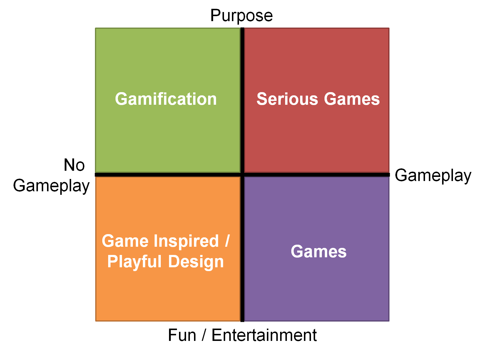

# Juegos
<!-- .slide: style="font-size: 0.9em" -->

Created by <i class="fab fa-telegram"></i>
[edme88](https://t.me/edme88)

---
## Gamificación en Contexto
Gamificación NO es:
- Convertir todo en juego
- Cualquier juego en lugar de un trabajo
- Cualquier uso de juegos en negocios
- Simulación (consitutye un "Serius Game", crea una experiencia de inmersión de una persona en un ambiente)
- Marketing o engagment de clientes
- Sólo PBLs (puntos, insignias, tablas de clasificación)
- Teoría de Juegos (trata de definir modelos, formas y estructuras matemáticas)

---
## Gamificación en Contexto
Gamificación SI es:
- Emplear los elementos de los juegos que pueden generar mayor compromiso (mecanismos y técnicas)
- Aprender del diseño de juegos... Y de psicología, adminsitración, marketing y economía, para mejorar la motivación, 
modificar el comportamiento humano creando ciertos patrones.
- Apreciar la diversión

---
## Clasificación

---
## Qué es un juego?
Según **Bernard Suits** un juego implica:
- Algún tipo de objetivo
- Reglas constitutivas
- Actitud lúdica (el jugador sigue las reglas voluntarimente)

Según **Johan Huinga** el juego es la superación de obstáculos innecesarios **voluntariamente**. Además, todo juego
crea un círculo mágico, donde existe un límite físico o virtual que divide al mundo del juego del mundo real, cada uno con renglas que pueden ser diferentes.

---
## Juegos y Jugar
Según **Roger Caillois**:
- Jugar es moverse con libertad dentro de una estructura.
- Un juego es un sistema cerrado formal que involucra a los jygadores en un conflicto estructurado y se resuelve con un desenlace.
- Un juego es una seria de decisiones significativas (las acciones tienen resultados).
- Un juego es dominio de contingencias artificiales que generan resultados interpretables.
- Un juego es solución de problemas con actitudes "de juego".

---
## Relación de Juegos y Gamificación
- Es voluntario
- Implica aprender o resolver problemas
- Balance de estructura y exploración

---
## Videojuegos
Implican sistemas digitales online.

En cifras...
- 66 billones de dólares anuales
- Aumento de ventas online
- Base de otras industrias (venta de bienes virtuales)
- Crecimiento de juegos móviles

---
## Videojuegos
Los videojuegos son fenómenos de masas.
97% de los niños y adolescentes (12-17) juega.
La edad promedio de los jugadores es 30 años.
El 47% de los jugadores son mujeres.

---
## Sólo es un juego?
Relación e importancia:
- E-Business
- Dimensión social
- Programas de fidelización
- Investigación de Marketing y Fidelización

---
## Videojuegos y Mundo Real
Ej. **American Army** es un juego empleado por el ejército para reclutar gente.

Se puede tomar el mundo real y transladarlo a un juego, y viceversa (vender bienes virtuales).

---
## Videojuegos y Mundo Real
| Concepto Juego | Actividad Real |
|----------------|----------------|
| Desafío | Competencia de ventas mensuales |
| Niveles | Programa de viajero frecuente |
| Equipo | |
| Recompensa | Café gratis después de una compra |
| Insignia | American express platinum |

La gamificación usa estos conceptos de manera sistemática para aprovechar el poder de la tecnología.

---
### Entrevista a Ethan Mollick
<iframe width="560" height="315" src="https://www.youtube.com/embed/P49n4GaLbxA" title="YouTube video player" frameborder="0" allow="accelerometer; autoplay; clipboard-write; encrypted-media; gyroscope; picture-in-picture" allowfullscreen></iframe>
Uso de juegos en empresas. Potencial de las técnicas que replican los juegos.

Ludificación -> Sociología -> Psicología
Motivación de la gente a actuar -> competición + compensación + status social

---
## ¿Dudas, Preguntas, Comentarios?

