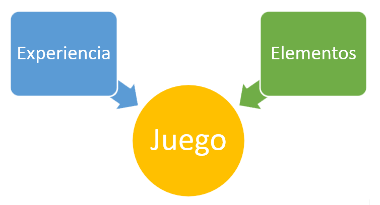
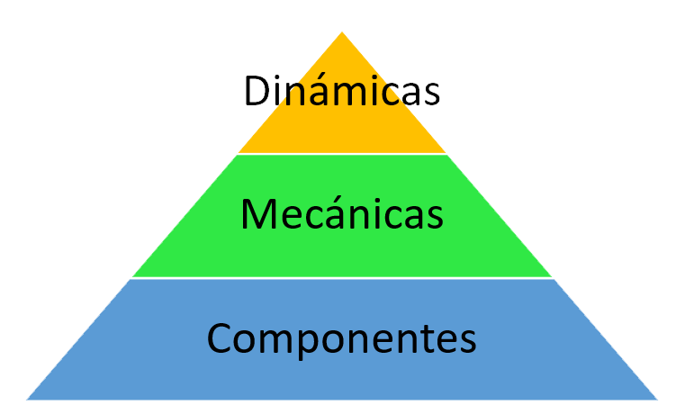

# Elementos de Juegos

Created by <i class="fab fa-telegram"></i>
[edme88](https://t.me/edme88)

---
## Desarmando los juegos
Los elementos de los juegos son herramientas para la gamificación.

Hay patrones regulares que se pueden extraer y usar.

Elementos -> La estructura hace a la esencia

---
## Desarmando los juegos
* Objetivos
* Misiones
* Niveles
* Puntos
* Avatar
* Progresión
* Social

* Tablero
* Fichas
* Jugadores
* Competitivo
* Turnos
* Ganador (estado, condición)
* No progresión

Las herramientas deben combinarse de manera sistemática.

---

---
Experiencia: Impacto general del juego, lo que sientes cuando juegas.

Elementos: Partes, piezas, fragmentos.

Juego: Es un conjunto de reglas. La estética, todos los elementos del juego, la experiencia.

Durante el diseño se "controla" el Juego, no la experiencia; pero tratas de producir una determinada expriencia.

---
## La pirámide de elementos de gamificación

Sistema para los elementos de gamificación:
Se deben usar los elementos eficazmente.
Aplicar diferentes tipos de elementos o piezas de los juegos de diferentes formas.

---
## Dinámicas
Elementos conceptuales de más alto nivel. Estructura interna que hace de alguna manera a la experiencia coherente y con patrones regulares (no son las reglas).

* Restricciones: Los juegos crean opciones significativas y problemas interesantes al limitar la libertad de la gente.
* Emociones: Puede producir emociones que hagan la experiencia más rica.
* Narrativa: Estructura que une las piezas del juego o del sistema gamifiado en un todo coherente. Puede ser explícita (trama) ó implícita (experiencia gráfica).
* Progresión: Oportunidad de mejora.
* Relaciones: Personas, interacciones entre ellas.

---
## Mecánica
Elementos que hacen a la acción de avanzar.

1. **Desafíos**: Objetivos a alcanzar
2. **Azar**: Parte de suerte implicada
3. **Competencia y Rivalidad**
4. **Cooperación**
5. **Feedback o Retroalimentación**: El usuario ve los resultados de lo que hace en tiempo real
6. **Adquisición de recursos**: Obtener cosas para avanzar
7. **Premios**: Beneficio que obtienes
8. **Transacciones**: Comprar, vender, intercambiar
9. **Turnos**
10. **Estado de Ganar**

---
## Componentes
Tipos de elementos del juego. Modelos concretos, formas concretas de hacer as cosas de nivel superior que representan la dinámica y la mecánica.

1. **Logros**: Recompensa al hacer un conjunto específico de cosas.
2. **Avatar**: Representación visual del personaje.
3. **Medallas**: Representaciones visuales específicas de los logros.
4. **Luchas finales**: Desafío muy duro y complejo.
5. **Colecciones**: Agrupar juntas un montón de cosas diferentes ensamblando ciertas piezas o modelos de algo.
6. **Combate**
7. **Desbloqueo de Contenido**: Hacer algo como completar un logro o subir un nivel para poder acceder a contenido nuevo.
8. **Regalos**: Altruismo, darle cosas a otros jugadores.
9. **Tabla de Puntuaciones**: Listas de jugadores por orden de puntuación.
10. **Niveles**
11. **Puntos**
12. **Misiones**
13. **Gráfico Social**: Ver a los camigos que también están en el juego y permitir interactuar con ellos. Para jugar con o en contra.
14. **Equipos**
15. **Bienes virtuales**: Cosas dentro del juego, algo que recojes.
Gran variedad de opciones!!!

---
## Puntos-Insignias-Tabla de Puntuación
Estos elementos de juegos son más comunes que otros y que son más influyentes en el diseño de ejemplos típicos de gamificación.

Sirven para una gran variedad de funciones diferentes.

---
## Puntos
Permiten llevar la cuenta, forma de determinar que tan bien alguien está en el juego.
Indican la posición relativa de los jugadores o definir el vencedor. 
Pueden relacionarse con recompensas.
Proveen de feedback, muestran en tiempo real como está en el juego.
Forma de inficar progresp/
Proporcionan datos al diseñador del juego, de cuantos puntos se ganan, que tan rápido, y eso puede ser usado para perfeccionar el juego.
Un punto, dentro de un sistema de puntuación, puede ser usado para representar cualquier cosa.

---
## Insignias
Representan logros.
Indicativo visual de que se alcanzó un cierto nivel, o que concluyó un conjunto de objetivos que le fueron atribuidos en el sistema gamificado.
Queda en el perfil o en algún otro lugar que los otros jugadores puedan ver.
Flexibilidad, para representar cualquier cosa a través de ellos.
Pueden transmitir estilo, tener un estilo gráfico propio, y los elementos o modelos de las insignias pueden representar y comunicar una sensación o patrón estético del sistema gamificado.
Señalan la importancia. Pueden representar logros, puntos o niveles.
Funcionan como credenciales, porque muestran los logros conseguidos.
Permiten coleccionar, y eso se vuelve un propósito en si mismo, una estructura o un mecanismo, que incentiva a las personas a jugar y sentirse más comprometida.
Son símbolo de status.

---
## Tabla de Puntuación - Ranking
Tienen que ver con la clasificación, muestran exactamente la posición relativa frente a las otras personas del juego.
Sirve para el feedback de la competencia.
Peligro de desmotivar si es demasiado bajo!
Ranking personalizados, relativo a los amigos, que estimula a querer competir.

---
## Limitaciones de los elementos
Los elementos no son el juego.

El juego es lo que está entre la experiencia y los elementos.

Lo que hace que los elementos tengan éxito es la manera en la cual están ligados.

La recompensa no es lo mismo que la diversión/

Si no tiene algún`elemento innovador fuera de los PLB, no se va a diferenciar de otros sitios o sistemas similares.

La "repetitividad" de enfocarse solo en los PLB puede generar desmotivación.

---
## Limitaciones de los elementos
Los elementos aunque sean útiles y una buena forma de empezar, no son en si mismos el juego.

Utilizar diversos elementos y mecánicas ayuda a atraer personas con diferentes tipos de motivaciones, y diferentes conceptos de que es la diversión.

Enfocarse solo en los PLB no produce>
- Decisiones significativas
- Puzles / Acertijos
- Maestría
- Comunidad
- Diferentes tipos de usuarios

---
## Entrevista a Bing Gordon

Todo CEO debe conocer sobre gamificación para poder motivar a sus empleados o sus clientes.

La gamificación es una forma dovertida de aplicar la teoría de la comunicación.

<iframe width="560" height="315" src="https://www.youtube.com/embed/pAv9eoEOwys" title="YouTube video player" frameborder="0" allow="accelerometer; autoplay; clipboard-write; encrypted-media; gyroscope; picture-in-picture" allowfullscreen></iframe>

---
## ¿Dudas, Preguntas, Comentarios?

