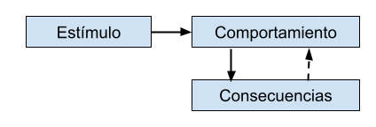
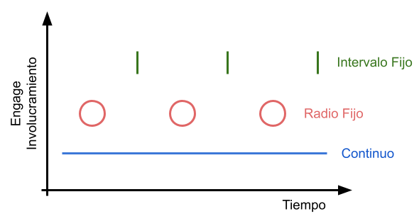

# Motivación y Psicología

Created by <i class="fab fa-telegram"></i>
[edme88](https://t.me/edme88)

---
## Diseño Motivacional
La psicología es esencial para la gamificación efectiva, porque permite indagar los procesos mentales que
intervienen en la gente que está envuelta en servicios lúdicos.

Motivación: Lo que te sientes inclinado a hacer. Es lo que hace que hagan las cosas otra vez.
La gente hace cosas por obtener premios.
Hay muchas cosas que la gente hace por diversos motivos, y no son los mismos motivos todo el tiempo.
Se debe pensar creativamente en el usuario y distintas formas de motivarlos.

---
## Comportamiento
Existen 2 tradiciones en psicología, el **conductismo** y el **cognoscitivismo**.

El **conductivismo** trata de examinar comportamientos observando el comportamiento externo de la gente.

El **cognoscitivismo** trata sobre estados mentales, lo que pasa dentro de la cabeza de la gente.

---
## Conductivismo
Habla de cómo influenciar la conducta a través del uso de estímulos. Un estímulo es algo externo a la personal.
El estímulo se asocia a un comportamiento.

El estímulo en gamificación es un condicionamiento operante (B. F. Skiner) que introduce la idea de consecuencias,
como refuerzos positivos o negativos. Hay una consecuencia buena o mala como resultado de las acciones, y como resultado
de la consecuencia, se cambia la conducta, y eso se llama aprendizaje.

---
## Conductivismo
La economía conductual tiene el mismo abordaje de pensamiento que las personas:
* Se preocupan más por las pérdidas que por las ganancias
* Las omisiones son importantes
* Sesgo de confirmación (la gente tiende a ver patrones)

---
## Conductivismo
Aprendizajes del conductivismo:
* Observación
* Importancia de los bucles de retroalimentación
* Refuerzo del estímulo
Fomentar ciertas actividades en un sistema gamificado.

---
## Conductivismo en gamificación
La investigación psicológica provee información del comportamiento útil para la gamificación.
* Observar lo que la gente realmente hace
* Enfocarse en la retroalimentación (donde estás y cómo avanzar)
* Las consecuencias pueden relacionarse con los resultados porque condicionan a la gente (bucle de condicionamiento operante)

---
## Conductivismo en gamificación
Mucha gamificación del tipo PBL está enfocado en las recompensas.
En la química del cerebro (el sistema de la dopamina) la estructura que está asociada al placer está asociada al aprendizaje.

---
## Estructuras de Recompensa
Existen varias maneras diferentes de recompensar:
* Muchas cosas diferentes pueden ser recompensa.
Hay que ser creativo en el diseño de la gamificaicón para pendar de forma amplia lo que puede ser recomensa; 
que comportamiento se quiere incentivar. Dar al usuario una gama de opciones que torne al juego más atrayente.
* Existen diferentes categorías de recomensas (Teoría de Evolución Cognitiva, Ryan Richard y Ed Deci, teoría de autodeterminación)
para motivar el comportamiento:
** Tangibles e Intangibles
** Esperadas e Inesperadas
** Conjunto de distinciones (contingentes)
- Tarea no contingente (el usuario no tiene que hacer nada para ganarla)
- Es contingente mediante una obligación (empezar a realizar una tarea)
- Contingente de conclusión
- Contingente de performance (hacer bien la tarea)

---
## Cuando Recompensar
Los estudios de comportamiento sugieren que la estructura del "reward scheduler" tiene implicaciones significativas
para la reacción psicológica que la recompensa produce.

---
## Cronograma de Recompensas
Hay varias diferentes:
* Continua (siempre)
* Radio fijo (cada n vez gana recompensa)
* Intervalo fijo (basada en tiempo, no lo que el usuario hace)
* Variable 

---
## Cronograma de Recompensas
El continuo es el menos óptimo, el de relación e intervalo fijo tienen cierto valor psicologico, pero los patrones son predecibles.

El variable es el más adecuado, porque el cerebro adora las sorpresas, lo fuera de lo normal, lo inesperado es interesantes.

Dimensiones de la "Variable"
* Se desconoce cuando ocurrirá
* Puede ser competitiva/No Competitiva
* Cierto/Incierto

---
## ¿Dudas, Preguntas, Comentarios?

