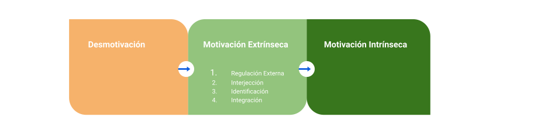

# Motivación y Psicología

Created by <i class="fab fa-telegram"></i>
[edme88](https://t.me/edme88)

---
## Límites del Conductivismo
Los bucles de realimentación pueden modificar sistemáticamente el comportamiento de las personas.

Los diferentes tipos de recompensas pueden construir diferentes tipos de sistemas para motivar el comportamiento.

Hay varias limitaciones en el enfoque conductivista, porque no permite saber lo que la gente piensa y siente. 
   
---
## Peligros del Conductivismo
Tiene la limitación de no enfocarse en lo que realmente motiva a las personas:
* Manipulación: Sistemas diseñados para que las personas hagan cosas. No se deben volver adictos, es poco ético.
Peligro: El usuario se siente empujado a hacer cosas que no quiere.
* Rueda Hedonista: Placer basado en diversión. Si se enfoca en dar recompensas, la gente solo actuará por eso. Si deja de haber recompensa, no actuarán. El cerebro da placer cuando sabe que la recompensa está por llegar.
* Énfasis excesivo en el conductivismo: El status es un motivador muy poderoso. No motiva a todos, todo el tiempo. La gente no actúa solo por el status, a veces por razones tangibles, altruistas, sociales. 
El conductivismo no tiene en cuenta otras motivaciones.

---
## Motivación Intrínseca y Extrínseca
La alternativa de un enfoque conductivista es el cognitivismo. El cognitivismo se enfoca en descubrir que motiva a la gente a comportarse de cierta forma.

Existen diferentes tipos de motivación y de recompensas.

* Recompensa Intrínseca: Se hacen las cosas por su propio beneficio, porque es gratificante, comprometedor, disfrutable, divertido, emocionante.
* Recompensa Extrínseca> Se hacen las cosas por alguna razón ajena a la misma. Puede ser por fama, fortuna,. Se hace por la recompensa.

---
## Motivación Intrínseca y Extrínseca
Diferentes tipos de categorías para recompensas, que son diferentes tipos de motivadores extrínsecos.
* Estatus: Lo hacemos porque pensamos que nos hará ver interesantes, que el resto valora y respeta el hecho de hacerlo.
* Acceso: Se recibe acceso a alguna cosa que el resto de personas no puede. Desbloqueo de contenido
* Poder: Se permite hacer ciertas cosas como resultado de la actividad.
* Cosas: Recompensas tangibles.

La "estructura" se basa en la noción jerárquica, y que tan poderosos son estos motivadores.
Pero debe tenerse en cuenta que las personas pueden tener diversas motivaciones.

---
## Como la recompensa puede desmotivar
La recompensa como motivador extrínseco puede desplazar la motivación intrínsea. Esto es el efecto de la "sobrejustificación".
* Tangibles: mayores efectos desmotivantes
* Inesperada: no suele influir
* Eventual de rendimiento: Puede actuar de ambas maneras. Desmotiva si es el objetivo final, pero motiva si es solo informativa, e suna señal de lo que se logró.

Para gamificar se debe conocer porque ciertos tipos de motivadores intrínsecos funcionan.

---
## Teoría de la Autodeterminación
La motivación intrínseca es ima de las formas más poderosas y efectivas de alentar a las personas a actuar en cierta forma.

En la teoría de la autodeterminación hay un espectro de tipos de motivación.
* Desmotivación: No se tiene motivación de ninguna forma, se es indiferente a la actividad.
* Motivación Intrínseca: Se hace porque gusta. La actividad es una recompensa en si misma.
* Extrínseco> Se hace la actividad por una razón ajena.

---
## Teoría de la Autodeterminación
La teoría de la autodeterminación dice que hay un espectro de las formas más externas hasta las más internas de motivación extrínseca.

1. Regulación externa: Se hace porque se siente la obligación de hacerlo. Se hace por una razón externa. No se valora ni encuentra sentido.
2. Interjección: A veces se toman motivadores externos y se hacen los propios.
3. Identificación: Se toman motivadores externos y se hacen los propios porque se alinean con los objetivos personales.
4. Integración: Alineación interna entre los objetivos propios y la actividad.

---
## Teoría de la Autodeterminación
Lo ideal es que la gente haga las cosas por su propio bien. Se debe aprender a utilizar las diferentes tipos de motivación apropiados para la situación. Se debe aproximar a la motivación intrínseca.

Hay 3 características de la motivación intrínseca, 3 factores que cuando están presentes, sugieren una actividad que valdrá la pena para la gente por si misma:
* Competencia
* Autonomía
* Afinidad

---
## Teoría de la Autodeterminación
* Competencia: Sentido de la persona de capacidad. Sienten que logran algo, resuelven problemas, superan obstáculos.
* Autonomía: La persona sienta que tiene el control (decisiones significativas).
* Afinidad: La actividad está conectada con la persona. La actividad tiene sentido o propósito.

---
## ¿Dudas, Preguntas, Comentarios?

